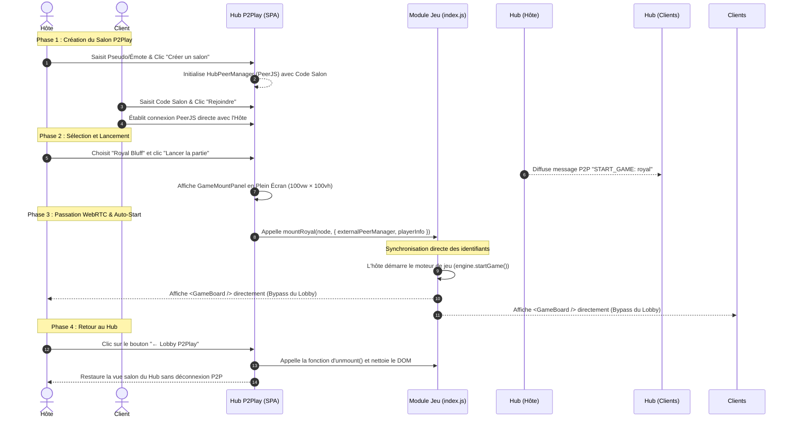

# 🏛️ Architecture du Hub P2Play

Ce document décrit les principes architecturaux du Hub P2Play, le protocole réseau WebRTC/PeerJS persistant, et le cycle de vie de la passation de session.

---

## 1. Philosophie Architecturales

### 🚫 Pourquoi "Pas d'iFrame" ?
Dans les architectures classiques d'orchestration web, les jeux sont souvent embarqués via des iFrames. Nous avons rejeté cette approche pour les raisons suivantes :
- **Intégration visuelle lourde** : Gestion complexe du scroll, des fenêtres modales et des styles CSS.
- **Rupture Réseau** : Nécessite une couche complexe de proxy `postMessage` pour faire transiter les paquets WebRTC entre le Hub parent et l'iFrame enfant.
- **Performances** : Chaque iFrame instancie un contexte DOM et JS séparé, alourdissant l'empreinte mémoire.

### ✨ L'Approche ES Module & Dynamic Script Injection
Le Hub P2Play fonctionne comme une **Single Page Application (SPA)** unique :
1. Les sous-jeux sont compilés sous forme d'**ES Modules isolés** (`index.js` + `style.css`).
2. Lors de la sélection d'un jeu, le Hub injecte dynamiquement une balise `<script type="module" src="/games/${gameKey}/index.js">` et sa feuille de style.
3. Le script expose une fonction globale `window.mountXxx(container, options)` sur l'objet window.
4. Le Hub appelle cette fonction de montage en lui passant le nœud DOM conteneur et l'instance réseau WebRTC déjà active.

---

## 2. Cycle de Vie du Salon Persistant ("Party Group")



---

## 3. Gestion Réseau & Abstract PeerManager

Le Hub instancie une classe `HubPeerManager` qui maintient la carte des connexions actives (`Map<string, DataConnection>`).

Lorsqu'un sous-jeu est monté :
- L'instance `globalHubPeer` est transmise via l'option `externalPeerManager`.
- Le hook `usePeer` du sous-jeu réutilise cette instance au lieu de créer une nouvelle instance PeerJS.
- Le sous-jeu enregistre son propre gestionnaire d'actions (`hostActionHandler`) et ses callbacks de réception d'état (`onStateReceived`).

---

## 4. Browser Polyfills (`window.process`)

Pour garantir la compatibilité des bundles compilés (React/React-DOM dépendent en interne de la variable globale Node.js `process.env.NODE_ENV`), le fichier `index.html` du Hub injecte un polyfill racine :

```html
<script>
  window.process = window.process || { env: { NODE_ENV: 'production' } };
</script>
```

Ce script garantit qu'aucune erreur `Uncaught ReferenceError: process is not defined` ne survienne lors de l'exécution des modules ES dans n'importe quel navigateur.
