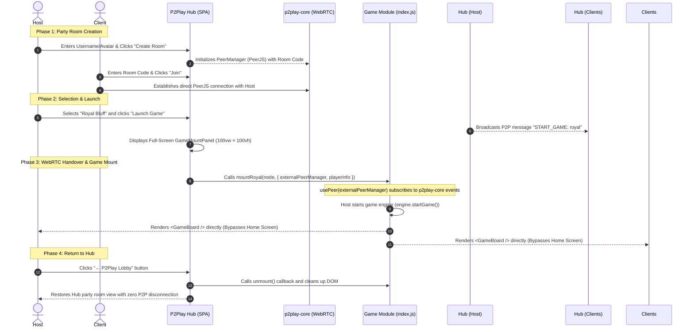

# 🏛️ P2Play Hub Architecture

This document describes the architectural principles of P2Play Hub, the persistent WebRTC/PeerJS network protocol powered by [`p2play-core`](https://github.com/gab371/p2play-core), and session handover lifecycle.

---

## 1. Architectural Philosophy

### 🚫 Why "No iFrames"?
In classic web orchestration architectures, games are often embedded inside iFrames. We rejected this approach for several key reasons:
- **Heavy Visual Integration**: Complex scrolling management, modal popups, and CSS styling isolation issues.
- **Network Disruption**: Requires a complex `postMessage` proxy layer to pass WebRTC packets between parent Hub and child iFrame.
- **Performance**: Each iFrame instantiates separate DOM and JS contexts, increasing memory footprint.

### ✨ The ES Module & Dynamic Script Injection Approach
P2Play Hub operates as a single **Single Page Application (SPA)**:
1. Sub-games are compiled as **isolated ES Modules** (`index.js` + `style.css`).
2. When selecting a game, Hub dynamically injects a `<script type="module" src="/games/${gameKey}/index.js">` tag and its stylesheet.
3. The script exposes a global `window.mountXxx(container, options)` function on the window object.
4. Hub calls this mount function, passing the target DOM container node and active WebRTC network instance (`externalPeerManager`).

---

## 2. Persistent Party Group Lifecycle


```mermaid
sequenceDiagram
    autonumber
    actor Host
    actor Client
    participant Hub as P2Play Hub (SPA)
    participant Core as p2play-core (WebRTC)
    participant Game as Game Module (index.js)

    Note over Host, Client: Phase 1: Party Room Creation
    Host->>Hub: Enters Username/Avatar & Clicks "Create Room"
    Hub-->>Core: Initializes PeerManager (PeerJS) with Room Code
    Client->>Hub: Enters Room Code & Clicks "Join"
    Client->>Core: Establishes direct PeerJS connection with Host

    Note over Host, Client: Phase 2: Selection & Launch
    Host->>Hub: Selects "Royal Bluff" and clicks "Launch Game"
    Hub (Host)-->>Hub (Clients): Broadcasts P2P message "START_GAME: royal"
    Hub->>Hub: Displays Full-Screen GameMountPanel (100vw × 100vh)

    Note over Host, Client: Phase 3: WebRTC Handover & Game Mount
    Hub->>Game: Calls mountRoyal(node, { externalPeerManager, playerInfo })
    Note over Game: usePeer(externalPeerManager) subscribes to p2play-core events
    Game->>Game: Host starts game engine (engine.startGame())
    Game-->>Host: Renders <GameBoard /> directly (Bypasses Home Screen)
    Game-->>Clients: Renders <GameBoard /> directly (Bypasses Home Screen)

    Note over Host, Client: Phase 4: Return to Hub
    Host->>Hub: Clicks "← P2Play Lobby" button
    Hub->>Game: Calls unmount() callback and cleans up DOM
    Hub-->>Host: Restores Hub party room view with zero P2P disconnection
```

---

## 3. Network Management & `PeerManagerLike` (`p2play-core`)

All network abstraction relies on `PeerManagerLike` interface and `PeerManager` class from **`p2play-core`**.

Hub instantiates a `HubPeerManager` (conforming to `PeerManagerLike`) to maintain active connections (`Map<string, DataConnection>`).

When a sub-game is mounted:
- Hub's active network instance is passed via `externalPeerManager` option.
- Sub-game's `usePeer` hook from `p2play-core` reuses this instance without re-instantiating PeerJS.
- Sub-game registers action handlers (`hostActionHandler`) and state callbacks (`onStateReceived`).
- Prefer **`attachPresenceHandlers`** from `p2play-core/presence` for host-side disconnect grace and `REQUEST_RECONNECT` (do not duplicate grace timers in each game).

### Heartbeat

Hub's peer manager and standalone `PeerManager` run **PING/PONG** heartbeats so silent WebRTC drops surface as `onPeerStatusChange(..., 'DISCONNECTED')`. Games react via presence (lobby remove vs in-game grace).

### Reconnect boundary (Hub vs game)

| Surface | Behavior (v0.6.0) |
|---------|-------------------|
| **In-game** (embedded or standalone) | Guest F5 / brief drop → session + `REQUEST_RECONNECT` + engine `remapPlayerId` within grace window |
| **Hub party room** | Auto-rejoin of the Hub salon after F5 is **not** required for game presence to work; host F5 still kills the room (no host migration) |

For full details on network API, voice, spectator, session, and presence, read the **[`p2play-core` Documentation](https://github.com/gab371/p2play-core)** — especially [Presence & Reconnect](https://github.com/gab371/p2play-core/blob/main/docs/presence-guide.md).

---

## 4. Browser Polyfills (`window.process`)

To ensure compatibility of compiled bundles (React/React-DOM depend internally on Node.js global `process.env.NODE_ENV`), Hub's `index.html` injects a root polyfill:

```html
<script>
  window.process = window.process || { env: { NODE_ENV: 'production' } };
</script>
```

This script ensures no `Uncaught ReferenceError: process is not defined` errors occur during ES module execution in any browser.
